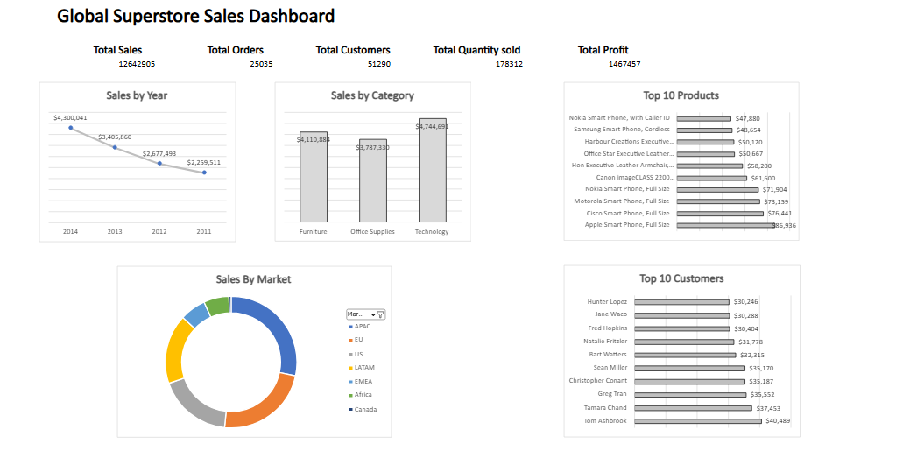

# 📊 Global Superstore Sales Dashboard

## Project Overview

This project analyzes the Global Superstore dataset using Microsoft Excel to uncover sales trends, customer behavior, and regional performance through an interactive dashboard.

---

## Business Problem

Businesses need clear visibility into sales performance across products, customers, and regions to support strategic decision-making.

This dashboard helps answer questions such as:

- Which category generates the highest sales?
- Which customers contribute the most revenue?
- Which products perform best?
- Which market performs best?
- How have sales changed over time?

---

## Dashboard Preview

---

## Tools Used

- Microsoft Excel
- Pivot Tables
- Pivot Charts
- Excel Tables

---

## Dashboard KPIs

- Total Sales
- Total Profit
- Total Orders
- Total Customers
- Total Quantity Sold

---

## Key Insights

- Technology generated the highest sales.
- APAC contributed significantly to total revenue.
- Sales trends changed over multiple years.
- Top customers contributed a substantial share of revenue.

---

## Files Included

- Dashboard Workbook (.xlsx)
- Dashboard PDF
- Dataset (.csv)

---

## Author

Olanrewaju Moses

Aspiring Data Analyst

Currently learning:
- Excel
- Power Query
- SQL
- Power BI
